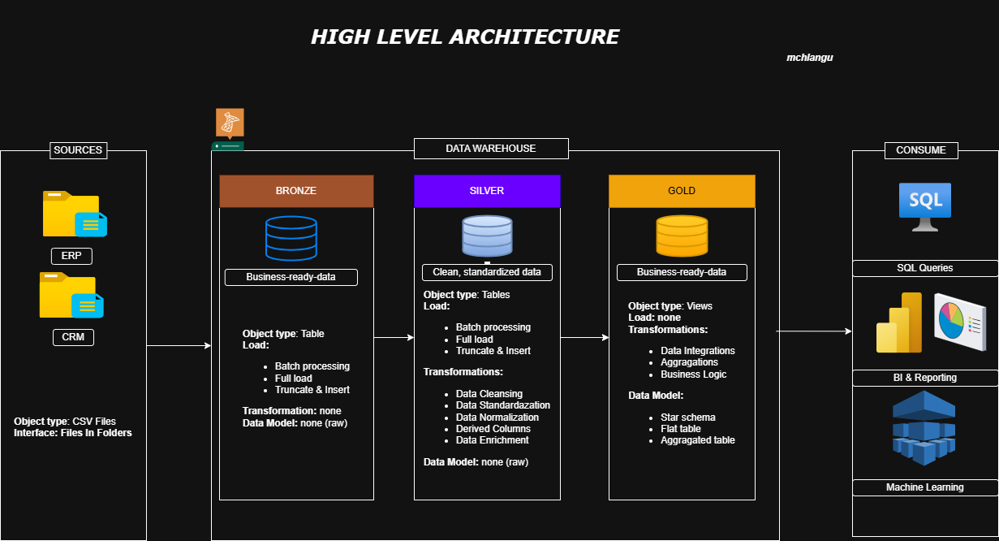

# Data warehouse and analytics project

Welcome to the Data Warehouse and Analytics Project repository!  
This project demonstrates a comprehensive data warehousing and analytics solution, from building a data warehouse to generating actionable insights. Designed as a portfolio project, it highlights industry best practices in data engineering and analytics.

 <h1  align="center"> <a href="docs/data_architecture.png">Data Architecture</a></h1>
 

1. **Bronze Layer:** Stores raw data as-is from the source systems. Data is ingested from CSV Files into SQL Server Database.  
2. **Silver Layer:** This layer includes data cleansing, standardization, and normalization processes to prepare data for analysis.  
3. **Gold Layer:** Business-ready data modeled into a star schema required for reporting and analytics.  

## Project Overview
This project involves:  

1. **Data Architecture:** Designing a Modern Data Warehouse Using Medallion Architecture Bronze, Silver, and Gold layers.  
2. **ETL Pipelines:** Extracting, transforming, and loading data from source systems into the warehouse.  
3. **Data Modeling:** Developing fact and dimension tables optimized for analytical queries.

## Important Links & Tools:  
[Datasets](datasets/) Access to the project dataset (csv files).  
[SQL Server Express:](https://www.microsoft.com/en-us/sql-server/sql-server-downloads) Lightweight server for hosting your SQL database.  
[SQL Server Management Studio (SSMS):](https://learn.microsoft.com/en-us/ssms/install/install?view=sql-server-ver20) GUI for managing and interacting with databases.  
[DrawIO:](https://www.drawio.com/) Design data architecture, models, flows, and diagrams.  
[Notion Project Steps:](https://www.notion.so/SQL-Data-Warehouse-Project-2a159b7e749c801a9cf4dd740477db33?source=copy_link) Access to All Project Phases and Tasks.  

## Project Requirements
Building the Data Warehouse (Data Engineering)  
Objective  
Develop a modern data warehouse using SQL Server to consolidate sales data, enabling analytical reporting and informed decision-making.  

Specifications  
- **Data Sources:** Import data from two source systems (ERP and CRM) provided as CSV files.
- **Data Quality:** Cleanse and resolve data quality issues prior to analysis.
- **Integration:** Combine both sources into a single, user-friendly data model designed for analytical queries.
- **Scope:** Focus on the latest dataset only; historization of data is not required.
- **Documentation:** Provide clear documentation of the data model to support both business stakeholders and analytics teams.

 ## About Me
A software developer specializing in problem-solving, whether it involves learning new programming languages and frameworks, debugging code, designing features, or understanding complex systems. I am currently seeking an opportunity to leverage my analytical and creative skills to develop solutions and build innovative software

Let's stay in touch! Feel free to connect with me on the following platform  

